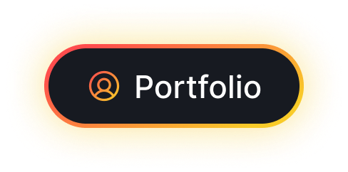

# 👋 Welcome / Bienvenue sur mon Profil GitHub!

**Matthieu Claessens** | **Full-Stack Developer**  
*Application Developer Trainee (Bac+4) | AFPA France | React • Next.js • GraphQL • Java • Spring Boot • Docker*  
📍 France 🥖

  

  
  &nbsp;&nbsp;&nbsp;&nbsp;
  

---

## 🚀 What I Do / Ce que je fais

**Building scalable web solutions from concept to production**

- 💻 **Full-Stack**: React, Next.js, TypeScript, Kotlin, Spring Boot, Java, PHP  
- 📡 **APIs**: REST, GraphQL  
- 🎨 **UI/UX**: Tailwind CSS, Figma, Bootstrap, Penpot  
- 🗄️ **Databases**: MySQL, PostgreSQL, UML/Merise  
- 🐳 **DevOps**: Docker, Git, Jenkins CI/CD  
- 🔧 **Best Practices**: Clean Code, Unit Testing  
- 🤝 **Open Source**: Active GitHub contributor

---

## 🛠️ Tech Stack 2025

| **Frontend** | **Backend** | **Database** | **DevOps** | **Design** |
|:------------:|:-----------:|:------------:|:----------:|:----------:|
|  |  |  |  |  |
|  |  |  |  |  |
|  |  | |  |  |
| |  | | |  |
|  | | | | |

---

## 🔥 Featured Projects / Projets Phares

| **Project** | **Role** | **Tech Stack** | **Description** |
|:-----------:|:--------:|:--------------:|:---------------:|
| **[gestionEleves](https://github.com/baptisterou/gestionEleves/)** | **Key Contributor** | Java • Spring • React • PostgreSQL • Tailwind | Student management platform - Active PRs |

---

## 🌟 Open Source Contributions

**Student Management Platform / Plateforme de gestion élèves**  
**[Repo →](https://github.com/baptisterou/gestionEleves/)** | **[My PRs →](https://github.com/baptisterou/gestionEleves/pulls?q=is%3Apr+author%3AMatthieuClaessens)**

**Key Contributions / Contributions clés :**  # 👋 Welcome / Bienvenue sur mon Profil GitHub!

**Matthieu Claessens** | **Full-Stack Developer**  
*Application Developer Trainee (Bac+4) | AFPA France | Spring • Java • React • Tailwind*  
📍 France 🥖

  

  
  &nbsp;&nbsp;&nbsp;&nbsp;
  

---

## 🚀 What I Do / Ce que je fais

**Building scalable web solutions from concept to production**

- 💻 **Main Stack**: Spring Boot, Java, React, Tailwind  
- 📡 **APIs**: REST, GraphQL  
- 🎨 **UI/UX**: Tailwind, Figma, Bootstrap  
- 🗄️ **Databases**: MySQL, PostgreSQL  
- 🐳 **DevOps**: Docker, Git, Jenkins CI/CD  
- 🔧 **Best Practices**: Clean Code, Unit Testing  
- 🤝 **Open Source**: Active GitHub contributor  

---

## 🛠️ Main Tech Stack 2025

| **Frontend** | **Backend** | **UI** |
|:------------:|:-----------:|:------:|
|  |  |  |
|  | | |

**Other Tools & Technologies:** Next.js, TypeScript, GraphQL, Kotlin, PHP, PostgreSQL, Docker, Jenkins

---

## 🔥 Featured Projects / Projets Phares

| **Project** | **Role** | **Tech Stack** | **Description** |
|:-----------:|:--------:|:--------------:|:---------------:|
| **[gestionEleves](https://github.com/baptisterou/gestionEleves/)** | **Key Contributor** | Java • Spring • React • PostgreSQL • Tailwind | Student management platform - Active PRs |

---

## 🌟 Open Source Contributions

**Student Management Platform / Plateforme de gestion élèves**  
**[Repo →](https://github.com/baptisterou/gestionEleves/)** | **[My PRs →](https://github.com/baptisterou/gestionEleves/pulls?q=is%3Apr+author%3AMatthieuClaessens)**

**Key Contributions / Contributions clés :**  
 🔧 REST & GraphQL APIs - Security & performance improvements  
 📱 React & Next.js Frontend - Responsive UI enhancements  
 🗄️ MySQL - Schema optimization & queries  

---

---

**💡 Want to collaborate? Feel free to reach out!**  
**💬 Full-Stack • Open Source projects**  

 🔧 **REST & GraphQL APIs** - Security & performance improvements  
 📱 **React & Next.js Frontend** - Responsive UI enhancements  
 🗄️ **MySQL** - Schema optimization & queries  

---

---

**💡 Want to collaborate? Feel free to reach out!**  
**💬 Full-Stack  • Open Source projects**  

  

